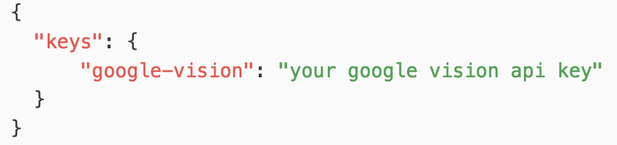
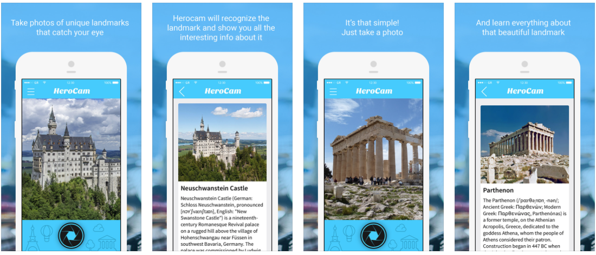
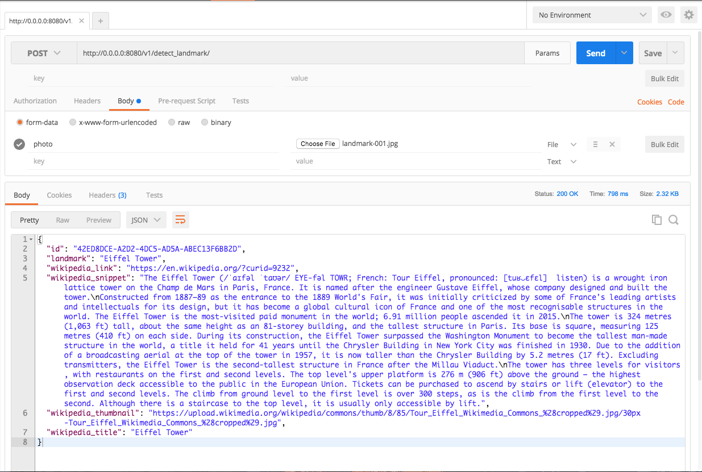

# Herocam Service 

A basic Swift/Vapor webservice that is used by the [HeroCam app](https://herocamapp.github.io). The service is using the [Google Vision API](https://cloud.google.com/vision/). In order to run the service you need to make a free account and obtain a Google vision API secret key

## 🔧 Build

In order to build the service you need to add the  `keys.json `  in the  `Config/ ` folder. The  `keys.json `  needs to have the following format.

##  🏃 Run

In order to run the server locally on localhost 8080:

 `$ vapor build ` 

` $ vapor run serve`

or open it using Xcode and press run: (make sure that you have selected the App Scheme)

` $ vapor xcode -y`

## 🔧 Compatibility

The service has been tested on macOS and Ubuntu.

## 📱 Client App

You can find the client-app available on the [ App Store](https://itunes.apple.com/us/app/herocam/id1078111204?ls=1&mt=8). 

## 🌐 Test

An example screenshot from Postman:

